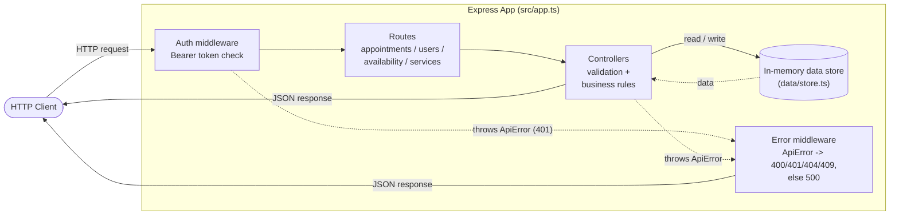

# Appointment Scheduler API

[](https://github.com/ProductDock/appointment-scheduler-api/actions/workflows/ci.yml)

A small REST API for booking, rescheduling, and cancelling appointments, built with **Node.js**, **Express**, and **TypeScript**. Data is kept in an in-memory store, so it's meant for local development, demos, and testing rather than production use.

Full CRUD for appointments, users, and services, plus provider availability lookups — matching the accompanying OpenAPI spec.

## Component diagram



`GET /health` bypasses the auth middleware entirely (not pictured above, for simplicity) — deploy platforms and load balancers need to reach it without a token. Rate limiting (see below) sits between the health route and the auth middleware, so it also isn't pictured — a `429` from it never reaches `ErrorMW`, since `express-rate-limit` sends its own JSON response directly.

## Requirements

-   Node.js 18+ (developed/tested on Node 22)
-   npm

## Install

```bash
npm install
```

## Environment variables

Copy the example file and adjust as needed:

```bash
cp dev.env.example dev.env
```

| Variable          | Description                                                                             | Default                            |
| ----------------- | ---------------------------------------------------------------------------------------- | ----------------------------------- |
| `PORT`            | Port the HTTP server binds to                                                           | `8080`                              |
| `API_TOKEN`       | Bearer token accepted in the `Authorization` header; default rate-limit tier            | `changeme`                          |
| `AGENT_API_TOKEN` | Alternate bearer token, identical API access, higher rate-limit tier (used by the MCP server) | `changeme-agent`              |
| `API_BASE_URL`    | Only used by the [MCP server](#mcp-server) to reach the running API                     | `http://localhost:${PORT ?? 8080}`  |

`dev.env` is loaded automatically on startup (via `dotenv`) and is git-ignored, so local overrides never get committed. `dev.env.example` is the committed template — keep it in sync whenever a new variable is added.

## Run

```bash
# Development (auto-reload on file changes)
npm run dev

# Production
npm run build
npm start
```

The server listens on `http://localhost:8080` by default. Override the port by setting `PORT` in `dev.env` (or as an environment variable directly). Every request is logged to stdout (method, path, status, response time) via `morgan`.

## Authentication

Every endpoint requires a bearer token matching either `API_TOKEN` or `AGENT_API_TOKEN`, sent in the `Authorization` header:

```bash
curl http://localhost:8080/services \
  -H "Authorization: Bearer $API_TOKEN"
```

Missing, malformed, or incorrect tokens get a `401` response. Both tokens grant identical API access (no per-user login, sessions, or expiry, and no permission differences between them) — enough to demonstrate an auth-protected API without adding a user/identity system to a project meant to stay small. The only difference between the two tokens is the rate-limit tier they get (see below).

## Rate limiting

Every endpoint except `/health` is rate-limited per IP. Requests authenticated with `AGENT_API_TOKEN` get 150 requests/minute; requests authenticated with the default `API_TOKEN` get 60. The tier is determined entirely by which token was used to authenticate, not by any header the caller sends — an earlier version of this used a self-declared `X-Client-Type` header instead, but that let any caller claim the higher tier for free by just setting a header, so it was replaced with this token-based check. The tier is also echoed into the server logs (`[client=agent]`) and the business-rule log lines in the controllers, so agent traffic is visible and distinguishable from human traffic without any extra tracing. Exceeding the limit returns `429`.

```bash
curl http://localhost:8080/services \
  -H "Authorization: Bearer $AGENT_API_TOKEN"
```

## Booking rules

`POST /appointments` and `PUT /appointments/:id` reject a `date` that's before today or more than a year out (`400`). Combined with the fixed weekly schedule in `PROVIDER_BASE_SLOTS`, this keeps bookings within a sensible window without needing a real calendar/scheduling system behind it. The full set of validation rules (unknown user/provider/service, time slots the provider doesn't offer, etc.) is documented in the OpenAPI spec.

## MCP server

[`src/mcp/server.ts`](src/mcp/server.ts) exposes this API to AI agents as an [MCP](https://modelcontextprotocol.io) server over stdio — `list_users`, `list_services`, `check_availability`, `book_appointment`, `list_appointments`, and `cancel_appointment`. It's a normal authenticated HTTP client of the real running API (it calls `/appointments`, `/users`, etc. over `fetch`, sending `Authorization: Bearer $AGENT_API_TOKEN`) — it doesn't import controllers or touch the in-memory store directly, so everything in the Rate limiting and Booking rules sections above applies to it exactly as it would to any other caller.

Two deliberate restrictions, both enforced in the MCP tool layer rather than the REST API: there's no `create_user` tool (the REST API supports creating users; agents can't autonomously add identity records through MCP), and `list_users` only returns `id`/`name` — never `email`/`phone` — since that's all `book_appointment`'s name matching actually needs. `GET /users` itself is unaffected by either restriction; a normal authorized caller still gets full user records.

Run the API first, then the MCP server in a separate terminal:

```bash
npm run dev    # terminal 1 — the real API, must be running
npm run mcp    # terminal 2 — the MCP server (stdio)
```

To try it interactively without wiring up an agent, use the [MCP Inspector](https://github.com/modelcontextprotocol/inspector):

```bash
npx @modelcontextprotocol/inspector npx tsx src/mcp/server.ts
```

To point a real reasoning agent at it instead, register it with [Claude Code](https://docs.claude.com/en/docs/claude-code/mcp) (`claude mcp add`, or by hand in its MCP config) using the same command the scripts above run, with `AGENT_API_TOKEN` and `API_BASE_URL` passed explicitly:

```json
{
  "mcpServers": {
    "appointment-scheduler": {
      "command": "npx",
      "args": [
        "tsx",
        "/absolute/path/to/appointment-scheduler-api/src/mcp/server.ts"
      ],
      "env": {
        "AGENT_API_TOKEN": "local-dev-agent-token",
        "API_BASE_URL": "http://localhost:8080"
      }
    }
  }
}
```

## Test

```bash
# Run the test suite once
npm test

# Watch mode
npm run test:watch

# Type-check only
npm run lint
```

Tests use Vitest and Supertest to exercise the Express app directly (no running server required), covering the main CRUD flows and the 400/401/404/409 error paths for each resource, plus a dedicated rate-limiter unit test ([`src/middleware/rateLimiter.test.ts`](src/middleware/rateLimiter.test.ts)) and a contract-test suite ([`src/test/contract/`](src/test/contract/)) that validates real responses against `docs/openapi.yaml`'s schemas, so the spec can't silently drift from what the API actually returns. A GitHub Actions workflow ([`.github/workflows/ci.yml`](.github/workflows/ci.yml)) runs `npm run lint` and `npm test` on every push and pull request.

## Project structure

```
src/
  types/               Shared TypeScript interfaces
  data/store.ts        In-memory seed data and id counters
  utils/               ApiError, and client-type detection for logs/rate limiting
  controllers/         Request handling + validation per resource
  routes/              Express routers, one per resource
  middleware/          Auth, rate limiting, 404, and centralized error handling
  mcp/                 MCP server exposing the API as agent-callable tools
  test/contract/       Validates real responses against docs/openapi.yaml
  app.ts               Express app factory
  index.ts             Server entrypoint
```

## API docs

-   **OpenAPI spec**: [`docs/openapi.yaml`](docs/openapi.yaml) describes every endpoint, request/response schema, and error case. Paste it into [editor.swagger.io](https://editor.swagger.io) or any OpenAPI viewer to browse it interactively.

## API overview

| Method | Path              | Description                                   |
| ------ | ----------------- | --------------------------------------------- |
| GET    | /health           | Health check (no auth required)               |
| GET    | /appointments     | List all appointments                         |
| POST   | /appointments     | Book a new appointment                        |
| GET    | /appointments/:id | Get a specific appointment                    |
| PUT    | /appointments/:id | Reschedule an appointment                     |
| DELETE | /appointments/:id | Cancel an appointment                         |
| GET    | /users            | List all users                                |
| POST   | /users            | Create a new user                             |
| GET    | /users/:id        | Get a specific user                           |
| PUT    | /users/:id        | Update a user                                 |
| DELETE | /users/:id        | Delete a user (409 if they have appointments) |
| GET    | /availability     | List provider availability                    |
| GET    | /services         | List all services                             |
| POST   | /services         | Create a new service                          |
| GET    | /services/:id     | Get a specific service                        |
| PUT    | /services/:id     | Update a service                              |
| DELETE | /services/:id     | Delete a service (409 if it has appointments) |

Full request/response shapes are defined in the OpenAPI spec provided with this project.

## License

[](https://opensource.org/licenses/Apache-2.0)
